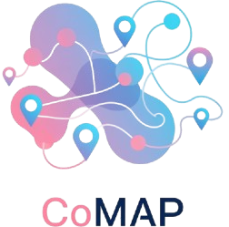
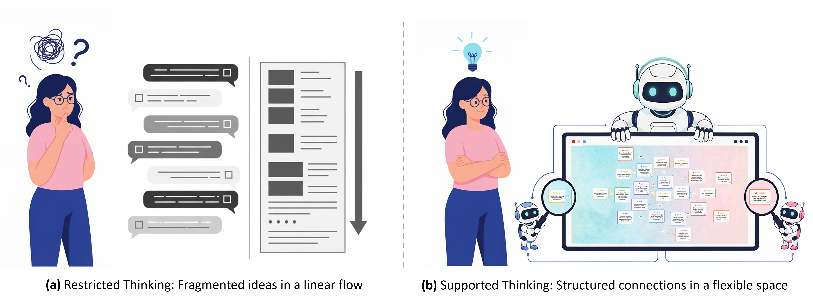

# Thinking in Graphs with CoMAP: A Shared Visual Workspace for Designing Project-Based Learning

## Overview

Designing project-based learning (PBL) requires managing highly interdependent components—a challenge for both traditional linear tools and purely conversational AI. Traditional tools fail to capture the non-linear, creative nature of design, while conversational systems lack persistent, shared context for reflective collaboration. 
<div align="center">
   
</div>

CoMAP is a system grounded in distributed cognition theory, introducing a graph-based collaboration paradigm. By providing a shared visual workspace with dual-modality AI support, CoMAP transforms the human-AI relationship from a prompt-and-response loop into a transparent and equitable partnership.

Our study with 30 educators demonstrates that CoMAP significantly improves teachers' design expression, divergent thinking, and iterative practice compared to a dialogue-only baseline. This nonlinear, artifact-centric approach fosters trust, reduces cognitive load, and empowers educators to take control of their creative process.

Our contributions are available at: [https://comap2025.github.io/](https://comap2025.github.io/)

---



*This figure conceptually contrasts two distinct paradigms for human-AI collaboration. (a) Represents the traditional paradigm, where the design process relies on linear tools and isolated conversational AI. This approach fails to capture the nonlinear nature of creative design. (b) Shows the CoMAP paradigm, which utilizes a shared visual workspace as a persistent cognitive artifact. This allows for the externalization of non-linear thoughts, providing users with a distinct alternative for human-AI collaboration that addresses the limitations of the traditional paradigm.*

---

## Repository Structure

- `frontend/` — The web-based user interface (UI) for CoMAP.
- `backend/` — The Python backend, including AI agents, API endpoints, and data management.
- `dataset/` — Anonymized user operation and dialogue logs for research and analysis.
- `analysis/` — Visualization of the survey/scale data.

---

## Getting Started

### Frontend

1. Navigate to the `frontend/` directory:
   ```powershell
   cd frontend
   ```
2. Install dependencies:
   ```powershell
   npm install
   ```
3. Start the development server:
   ```powershell
   npm run dev
   ```
4. Open your browser and visit the local address (usually [http://localhost:5173](http://localhost:5173)).

### Backend

1. Navigate to the `backend/` directory:
   ```powershell
   cd backend
   ```
2. (Optional) Create and activate a Python virtual environment.
3. Install dependencies:
   ```powershell
   pip install -r requirements.txt
   ```
4. Run the backend server:
   ```powershell
   python run.py
   ```

### Dataset

- The `dataset/` folder contains anonymized user operation and dialogue logs. These can be used for further research, analysis, or model training.

### Analysis

- The `analysis/` folder includes the visualization of the survey/scale data collected during the study.

---

## Project Roadmap & TODOs

- [ ] **Resizable Cards**: Allow users to drag and resize cards in the workspace.
- [ ] **Node Mutual Exclusion**: Implement logic to support mutually exclusive nodes.
- [ ] **Teacher Professional Development**: Integrate features supporting teacher growth and reflection.
- [ ] **Multi-user Collaboration**: Enable real-time collaborative editing and design.
- [ ] **Multilingual Support**: Add translation and localization for global accessibility.

---

For questions or contributions, please open an issue or pull request.


